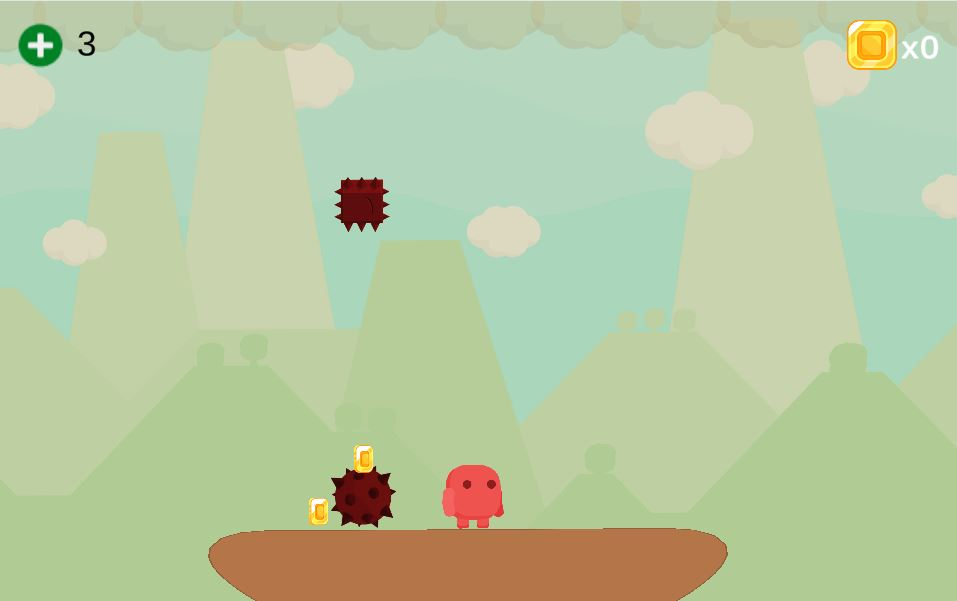
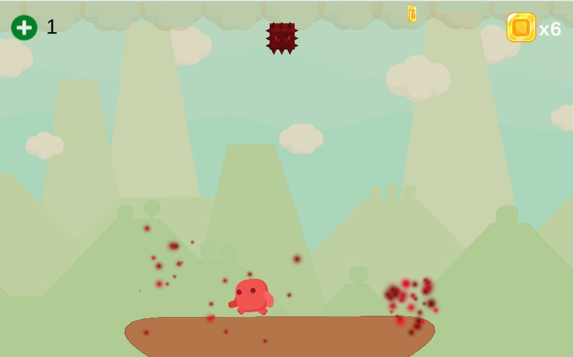
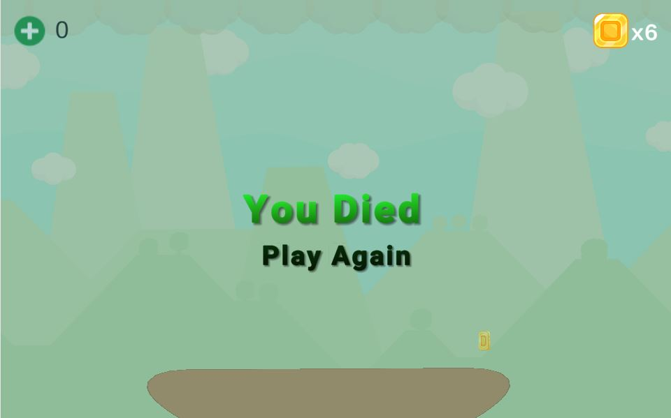

# Its Raining Hazards!
<h1><a href="https://brendancavey.itch.io/its-raining-hazards" target="_blank">Play it on itch.io!</a></h1>

<h2>Description</h2>
This high-score arcade game was made using the Unity game engine. It introduces gameplay elements that tests the player's reflexes and focus as they attempt to dodge falling proectiles. Collect falling coins to reach a new high score and beat your friends! The game features a dynamic difficulty system that increases difficulty as your score gets higher. Can you beat my record? Current best record: 21 points!

<h2>Description of Project</h2>
This game project utilizes object oriented programming to organize code for maximum reusability. The game was created using the Unity engine and makes use of C# scripts
in order for objects within the game to interact with each other. 

<h2>How to play</h2>
<li>Use the left and right arrow keys for player movement. </li>
<li>Dodge hazardous falling projectiles from the sky!</li>
<li>Collect falling coins to increase your score!</li>
<li>Game over if player gets hit 3 times.</li>

<h2>Game Engine</h2>
<li>Unity</li>

<h2>Language Used</h2>
<li>C#</li>

<h2>Screenshots</h2>

Falling Projectiles

Particles Effects

Gameover Screen

